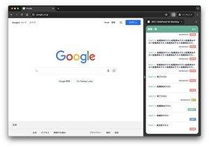

# SidePanel for Backlog

ブラウザのサイドパネル(もしくはサイドバー)に、Backlogの課題一覧を表示できる拡張機能です。

## 必要なもの

- 使用するBacklogのホスト名
  - `{スペースID}.backlog.com` または `{スペースID}.backlog.jp`
- APIキー
  - Backlogの[APIの設定](https://support-ja.backlog.com/hc/ja/articles/360035641754-API%E3%81%AE%E8%A8%AD%E5%AE%9A)を参考にAPIキーを発行してください。

## インストール

## 機能

### 課題一覧表示

Backlogの課題一覧をサイドパネルとポップアップに表示できます。

## アイコンについて

- 拡張機能のアイコンは、株式会社ヌーラボの[ロゴガイドライン](https://nulab.com/ja/about/logo/)に基づいて、開発を目的とした用途として使用しております。

## リンク

- [更新履歴](./CHANGELOG.md)
- [Backlog｜チームで使うプロジェクト管理・タスク管理ツール](https://backlog.com/ja/)
- [Backlog API](https://developer.nulab.com/docs/backlog#)

## License

This project is licensed under the MIT License - see the [LICENSE](LICENSE) file for details.
